# 📊 Architecture & Design Documentation

## Table of Contents
1. [Wireframe Diagrams](#wireframe-diagrams)
2. [Database Schema](#database-schema)
3. [System Architecture](#system-architecture)
4. [Data Flow Diagrams](#data-flow-diagrams)

---

## 🎨 Wireframe Diagrams

### 1. Authentication Flow

```
┌─────────────────────────────────────────────────────────────────────────────┐
│                          LANDING PAGE                                        │
├─────────────────────────────────────────────────────────────────────────────┤
│                                                                              │
│                          [App Logo/Icon]                                     │
│                                                                              │
│                          Adda Time                                           │
│                   Connect with friends securely                              │
│                                                                              │
│                                                                              │
│                    ┌──────────────────────┐                                 │
│                    │   Get Started  →     │                                 │
│                    └──────────────────────┘                                 │
│                                                                              │
└─────────────────────────────────────────────────────────────────────────────┘
                                    ↓
┌─────────────────────────────────────────────────────────────────────────────┐
│                          SIGN IN PAGE                                        │
├─────────────────────────────────────────────────────────────────────────────┤
│  ← Back                                                                      │
│                                                                              │
│                     Enter Your Phone Number                                  │
│                                                                              │
│  ┌────────────────────────────────────────────────────────────────┐        │
│  │  [Country Code ▼]  [Phone Number Input]                        │        │
│  └────────────────────────────────────────────────────────────────┘        │
│                                                                              │
│                    ┌──────────────────────┐                                 │
│                    │    Send OTP Code     │                                 │
│                    └──────────────────────┘                                 │
│                                                                              │
└─────────────────────────────────────────────────────────────────────────────┘
                                    ↓
┌─────────────────────────────────────────────────────────────────────────────┐
│                       SMS VERIFICATION                                       │
├─────────────────────────────────────────────────────────────────────────────┤
│  ← Back                                                                      │
│                                                                              │
│                    Verify Your Phone Number                                  │
│              Enter the 6-digit code sent to +1234567890                     │
│                                                                              │
│                    ┌─┐  ┌─┐  ┌─┐  ┌─┐  ┌─┐  ┌─┐                          │
│                    │ │  │ │  │ │  │ │  │ │  │ │                          │
│                    └─┘  └─┘  └─┘  └─┘  └─┘  └─┘                          │
│                                                                              │
│                Didn't receive code? Resend (30s)                            │
│                                                                              │
│                    ┌──────────────────────┐                                 │
│                    │       Verify         │                                 │
│                    └──────────────────────┘                                 │
│                                                                              │
└─────────────────────────────────────────────────────────────────────────────┘
                                    ↓
┌─────────────────────────────────────────────────────────────────────────────┐
│                      ONBOARDING / PROFILE SETUP                              │
├─────────────────────────────────────────────────────────────────────────────┤
│                                                                              │
│                        Create Your Profile                                   │
│                                                                              │
│                          ┌──────────┐                                       │
│                          │  [Photo] │                                       │
│                          │  Upload  │                                       │
│                          └──────────┘                                       │
│                                                                              │
│  Username:                                                                   │
│  ┌─────────────────────────────────────────────────────────────┐           │
│  │  Enter your username                                         │           │
│  └─────────────────────────────────────────────────────────────┘           │
│                                                                              │
│                    ┌──────────────────────┐                                 │
│                    │    Continue  →       │                                 │
│                    └──────────────────────┘                                 │
│                                                                              │
└─────────────────────────────────────────────────────────────────────────────┘
```

### 2. Main Dashboard

```
┌─────────────────────────────────────────────────────────────────────────────┐
│ DASHBOARD                                                       [Profile ⚙] │
├─────────────────────────────────────────────────────────────────────────────┤
│                                                                              │
│  ┌──────────────┐                                                           │
│  │ ● Online/    │                       Dashboard                           │
│  │   Invisible  │                                                           │
│  └──────────────┘                                                           │
│                                                                              │
│  🔍 [Search users or chats...]                      [≡ Menu]                │
│                                                                              │
├─────────────────────────────────────────────────────────────────────────────┤
│                         CONVERSATIONS                                        │
├─────────────────────────────────────────────────────────────────────────────┤
│  📌 PINNED                                                                   │
│  ┌─────────────────────────────────────────────────────────────────────┐  │
│  │ 👤 John Doe                                  📌        2m ago        │  │
│  │    Hey, how are you doing?                            [2]            │  │
│  └─────────────────────────────────────────────────────────────────────┘  │
│                                                                              │
│  💬 ALL CHATS                                                               │
│  ┌─────────────────────────────────────────────────────────────────────┐  │
│  │ 👥 Project Team                                      5:30 PM         │  │
│  │    Alice: Let's meet tomorrow                        [3]            │  │
│  └─────────────────────────────────────────────────────────────────────┘  │
│  ┌─────────────────────────────────────────────────────────────────────┐  │
│  │ 👤 Sarah Smith                           ● Online    Yesterday      │  │
│  │    See you tomorrow!                                  ✓✓            │  │
│  └─────────────────────────────────────────────────────────────────────┘  │
│  ┌─────────────────────────────────────────────────────────────────────┐  │
│  │ 👤 Mike Johnson                                      Dec 26         │  │
│  │    Thanks for your help                               ✓✓            │  │
│  └─────────────────────────────────────────────────────────────────────┘  │
│                                                                              │
├─────────────────────────────────────────────────────────────────────────────┤
│               [🏠 Home]  [💬 Chats]  [👤 Profile]                          │
└─────────────────────────────────────────────────────────────────────────────┘
                                                        [➕] (Floating Action Button)
```

### 3. Chat View

```
┌─────────────────────────────────────────────────────────────────────────────┐
│ ← John Doe                            ● Online         📞 📹 ⋮             │
├─────────────────────────────────────────────────────────────────────────────┤
│                                                                              │
│                        [Dec 28, 2025]                                        │
│                                                                              │
│  ┌──────────────────────────────────┐                                      │
│  │ Hey! How's your project going?   │                          10:30 AM    │
│  └──────────────────────────────────┘                                      │
│                                                                              │
│                                      ┌─────────────────────────────────┐   │
│                          11:15 AM    │ Going great! Just finished     │   │
│                                      │ the encryption feature 🎉      │   │
│                                      └─────────────────────────────────┘   │
│                                                                          ✓✓ │
│                                                                              │
│  ┌──────────────────────────────────┐                                      │
│  │ That's awesome! Can I see?       │                          11:16 AM    │
│  └──────────────────────────────────┘                                      │
│                                                                              │
│                                      ┌─────────────────────────────────┐   │
│                          11:20 AM    │ [📷 Screenshot.png]            │   │
│                                      │                                 │   │
│                                      └─────────────────────────────────┘   │
│                                                                          ✓✓ │
│                                                                              │
│  John is typing...                                                          │
│                                                                              │
├─────────────────────────────────────────────────────────────────────────────┤
│  [😊] [📎]  Type a message...                               [🎤]  [➤]     │
└─────────────────────────────────────────────────────────────────────────────┘
```

### 4. Create Chat / User Search

```
┌─────────────────────────────────────────────────────────────────────────────┐
│ ← New Chat                                                                   │
├─────────────────────────────────────────────────────────────────────────────┤
│                                                                              │
│  🔍 [Search users...]                                                       │
│                                                                              │
│  ┌──────────────────────┐  ┌──────────────────────┐                       │
│  │   [👤] Private Chat  │  │   [👥] Group Chat    │                       │
│  └──────────────────────┘  └──────────────────────┘                       │
│                                                                              │
├─────────────────────────────────────────────────────────────────────────────┤
│  USERS                                                                       │
├─────────────────────────────────────────────────────────────────────────────┤
│  ┌─────────────────────────────────────────────────────────────────────┐  │
│  │  ○  👤 Alice Johnson               ● Online          [✓ Selected]   │  │
│  │      @alice • Last seen: just now                                    │  │
│  └─────────────────────────────────────────────────────────────────────┘  │
│  ┌─────────────────────────────────────────────────────────────────────┐  │
│  │  ○  👤 Bob Williams                ● Online                         │  │
│  │      @bob • Last seen: 2m ago                                        │  │
│  └─────────────────────────────────────────────────────────────────────┘  │
│  ┌─────────────────────────────────────────────────────────────────────┐  │
│  │  ○  👤 Carol Davis                 Offline                          │  │
│  │      @carol • Last seen: 1h ago                                      │  │
│  └─────────────────────────────────────────────────────────────────────┘  │
│                                                                              │
│                                                                              │
│                    ┌──────────────────────┐                                 │
│                    │   Create Chat  →     │                                 │
│                    └──────────────────────┘                                 │
│                                                                              │
└─────────────────────────────────────────────────────────────────────────────┘
```

### 5. Profile View

```
┌─────────────────────────────────────────────────────────────────────────────┐
│ ← Profile                                                          [Edit]    │
├─────────────────────────────────────────────────────────────────────────────┤
│                                                                              │
│                          ┌──────────────┐                                   │
│                          │   [Photo]    │                                   │
│                          │   150x150    │                                   │
│                          └──────────────┘                                   │
│                                                                              │
│                           John Doe                                           │
│                         @johndoe123                                          │
│                       +1 (555) 123-4567                                      │
│                                                                              │
├─────────────────────────────────────────────────────────────────────────────┤
│  📊 STATUS                                                                   │
│  ┌─────────────────────────────────────────────────────────────────────┐  │
│  │  Account Status: Active                                             │  │
│  │  Member Since: Dec 25, 2025                                         │  │
│  └─────────────────────────────────────────────────────────────────────┘  │
│                                                                              │
│  🔒 PRIVACY                                                                  │
│  ┌─────────────────────────────────────────────────────────────────────┐  │
│  │  Hide Online Status              [Toggle Switch: ON/OFF]            │  │
│  └─────────────────────────────────────────────────────────────────────┘  │
│                                                                              │
│  📧 CONTACT                                                                  │
│  ┌─────────────────────────────────────────────────────────────────────┐  │
│  │  Phone: +1 (555) 123-4567                                           │  │
│  │  User ID: jd******123                                               │  │
│  └─────────────────────────────────────────────────────────────────────┘  │
│                                                                              │
│                    ┌──────────────────────┐                                 │
│                    │     Sign Out         │                                 │
│                    └──────────────────────┘                                 │
│                                                                              │
└─────────────────────────────────────────────────────────────────────────────┘
```

### 6. Chat Options Menu

```
┌─────────────────────────────────────────────────────────────────────────────┐
│                      CHAT OPTIONS                                            │
├─────────────────────────────────────────────────────────────────────────────┤
│                                                                              │
│  ┌─────────────────────────────────────────────────────────────────────┐  │
│  │  📌  Pin Chat                                                        │  │
│  └─────────────────────────────────────────────────────────────────────┘  │
│  ┌─────────────────────────────────────────────────────────────────────┐  │
│  │  📦  Archive Chat                                                    │  │
│  └─────────────────────────────────────────────────────────────────────┘  │
│  ┌─────────────────────────────────────────────────────────────────────┐  │
│  │  👁️  Hide Chat                                                       │  │
│  └─────────────────────────────────────────────────────────────────────┘  │
│  ┌─────────────────────────────────────────────────────────────────────┐  │
│  │  🚫  Block User                                                      │  │
│  └─────────────────────────────────────────────────────────────────────┘  │
│  ┌─────────────────────────────────────────────────────────────────────┐  │
│  │  🗑️  Delete Chat                                                     │  │
│  └─────────────────────────────────────────────────────────────────────┘  │
│  ┌─────────────────────────────────────────────────────────────────────┐  │
│  │  ✕  Cancel                                                           │  │
│  └─────────────────────────────────────────────────────────────────────┘  │
│                                                                              │
└─────────────────────────────────────────────────────────────────────────────┘
```

---

## 🗄️ Database Schema

### Firebase Firestore Collections

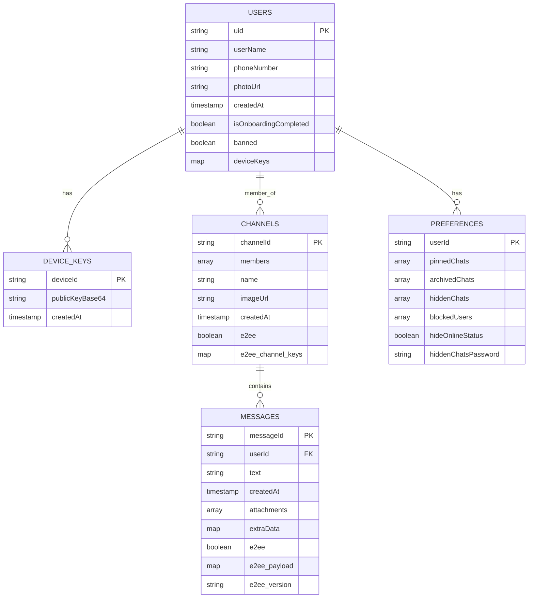

### Stream Chat Data Structure

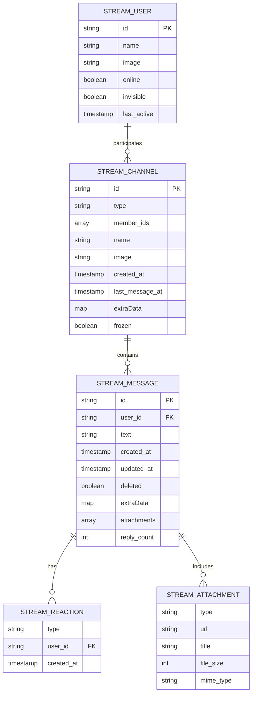

### Local Storage Schema (Flutter Secure Storage)

```
┌──────────────────────────────────────────────────────────┐
│          FLUTTER SECURE STORAGE                           │
├──────────────────────────────────────────────────────────┤
│                                                           │
│  Encryption Keys:                                         │
│  ├─ e2ee_device_id_v1        : string                    │
│  ├─ e2ee_public_v1           : base64 string             │
│  ├─ e2ee_private_v1          : base64 string             │
│  └─ e2ee_aes_key_v1          : base64 string             │
│                                                           │
│  Chat Preferences:                                        │
│  ├─ pinned_chats             : JSON array                │
│  ├─ archived_chats           : JSON array                │
│  ├─ hidden_chats             : JSON array                │
│  ├─ blocked_users            : JSON array                │
│  ├─ hide_online_status       : boolean                   │
│  └─ hidden_chats_password    : hashed string             │
│                                                           │
└──────────────────────────────────────────────────────────┘
```

---

## 🏗️ System Architecture

### High-Level Architecture Diagram

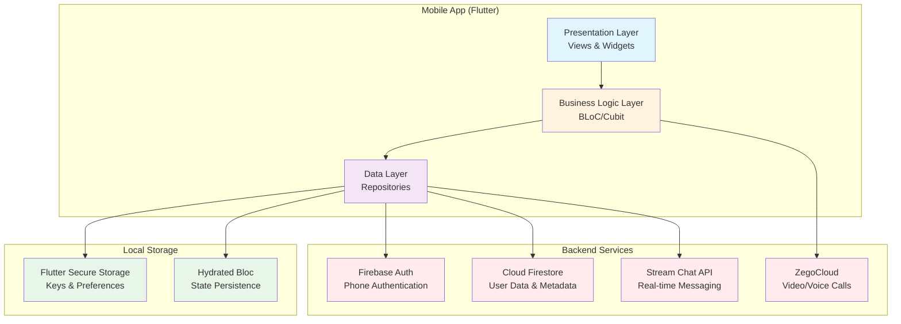

### MVVM Architecture Pattern

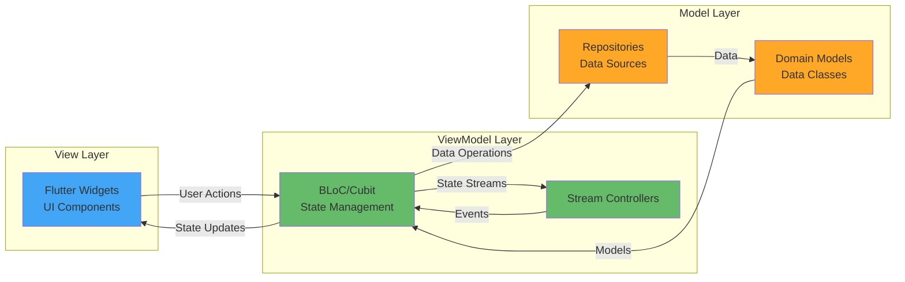

---

## 🔄 Data Flow Diagrams

### 1. Authentication Flow

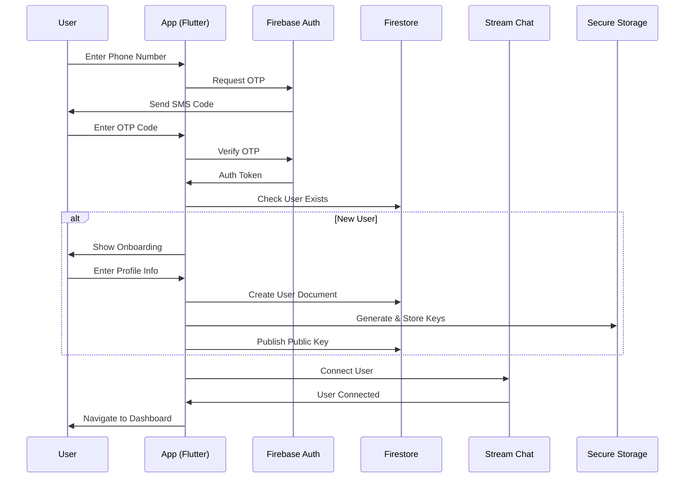

### 2. Message Sending Flow (with E2EE)

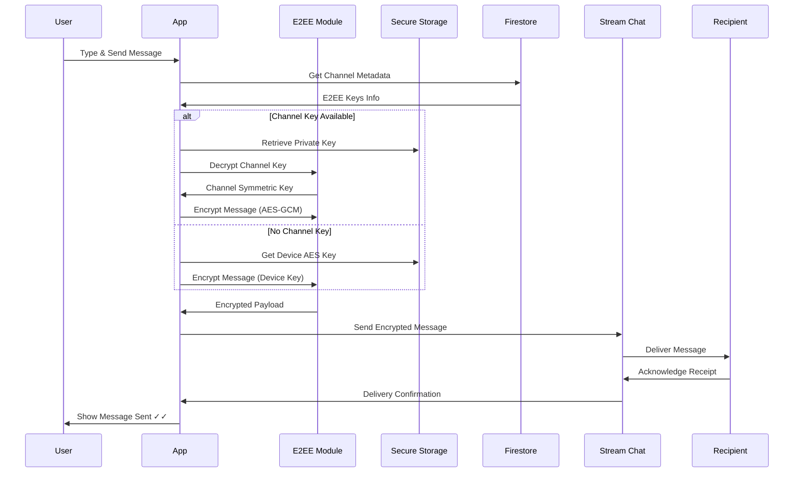

### 3. Chat Management Flow

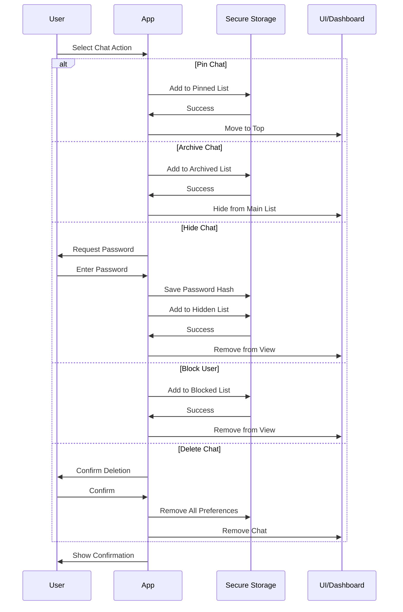

### 4. Real-time Message Delivery

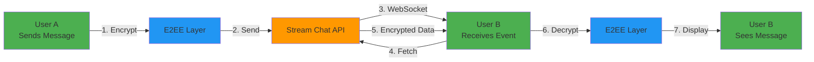

---

## 🔐 Encryption Architecture

### Two-Layer Encryption System

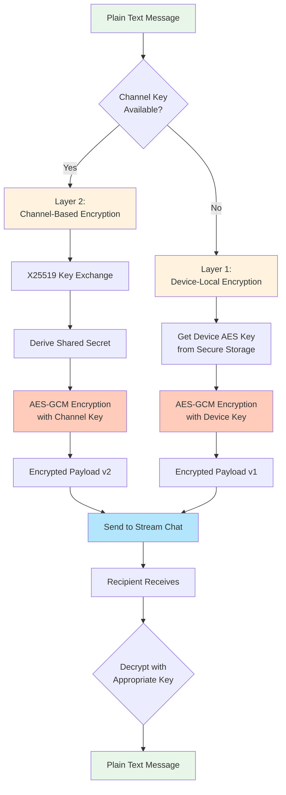

### Key Management Flow

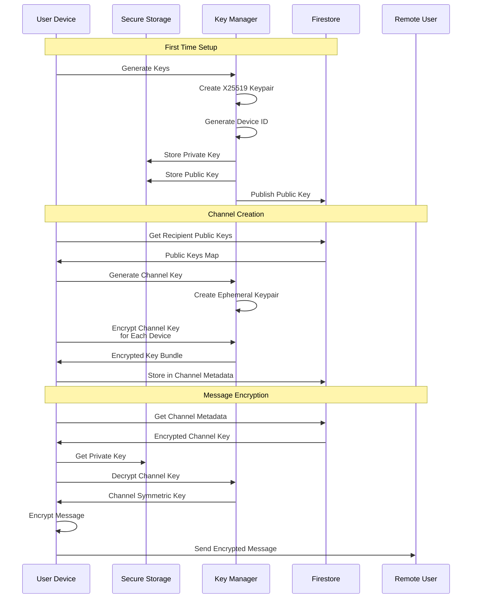

---

## 📊 State Management Architecture

### BLoC Pattern Implementation

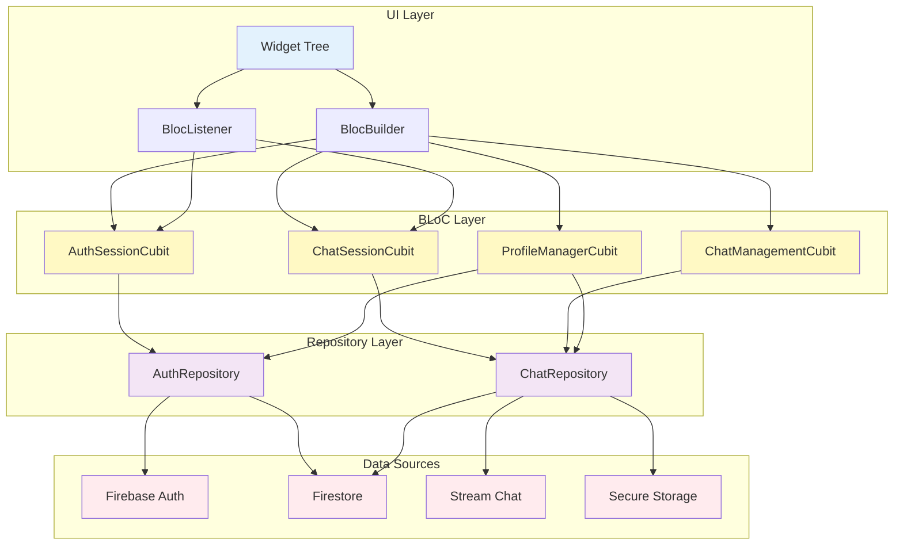

---

## 🔄 Navigation Flow

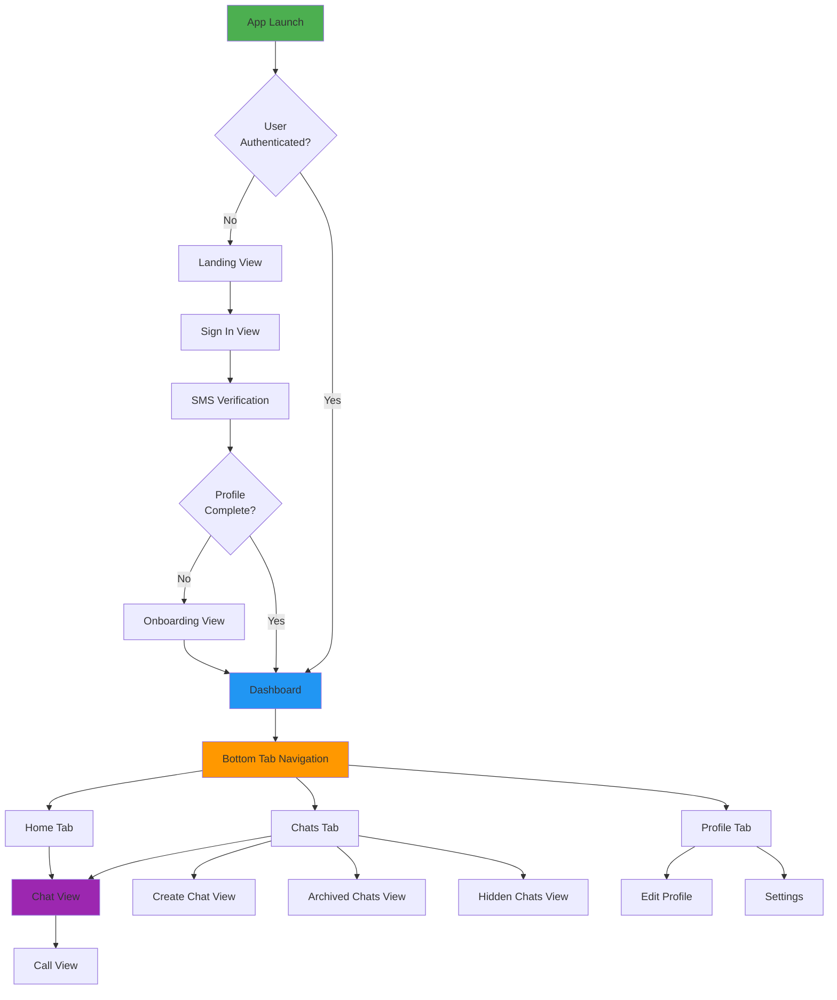

---

## 📝 Notes

### Technology Stack Summary

| Layer | Technology | Purpose |
|-------|-----------|---------|
| **Frontend** | Flutter 3.0+ | Cross-platform mobile UI |
| **State Management** | flutter_bloc | Reactive state management |
| **Navigation** | go_router | Declarative routing |
| **Dependency Injection** | get_it | Service locator |
| **Authentication** | Firebase Auth | Phone authentication |
| **Database** | Cloud Firestore | User data & metadata |
| **Messaging** | Stream Chat SDK | Real-time messaging |
| **Encryption** | cryptography + encrypt | AES-GCM + X25519 |
| **Local Storage** | flutter_secure_storage | Encrypted key storage |
| **State Persistence** | hydrated_bloc | Offline state |
| **Video/Voice** | ZegoCloud | WebRTC calls |

### Security Features

1. **End-to-End Encryption**: Two-layer encryption system with AES-GCM and X25519
2. **Secure Key Storage**: All encryption keys stored in Flutter Secure Storage
3. **Perfect Forward Secrecy**: Ephemeral keys for channel encryption
4. **Password Protection**: Hashed passwords for hidden chats
5. **Privacy Controls**: Hide online status, block users

### Scalability Considerations

1. **Stream Chat**: Handles message delivery and synchronization at scale
2. **Firestore**: NoSQL structure supports horizontal scaling
3. **Local Caching**: Hydrated BLoC for offline functionality
4. **Lazy Loading**: Pagination for chat lists and messages
5. **Connection Pooling**: Efficient WebSocket management

---

**Documentation Version**: 1.0  
**Last Updated**: December 28, 2025  
**Project**: Adda Time
